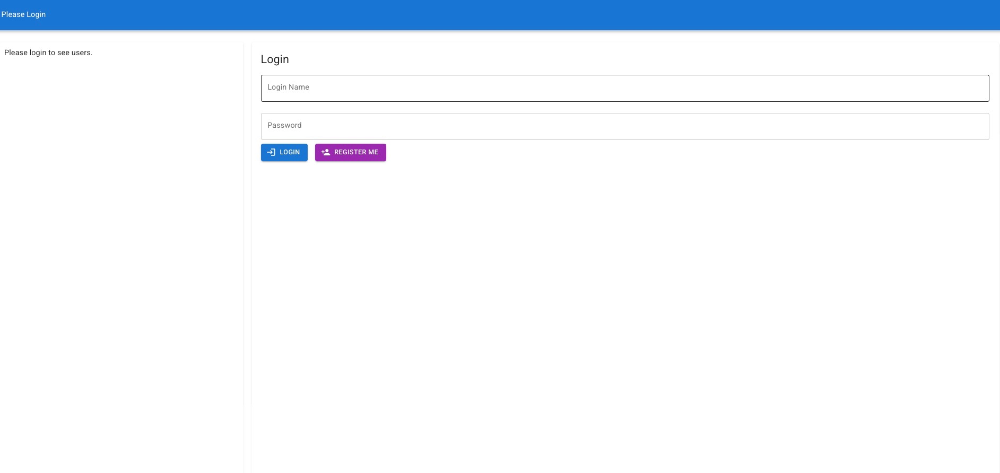
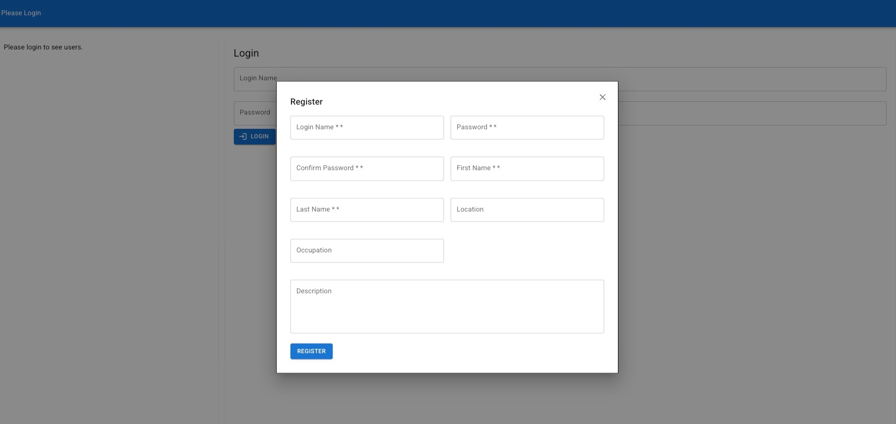
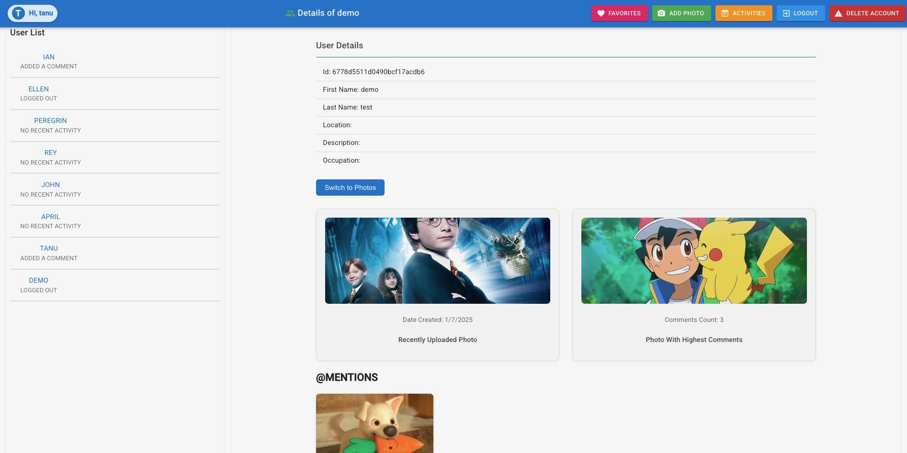
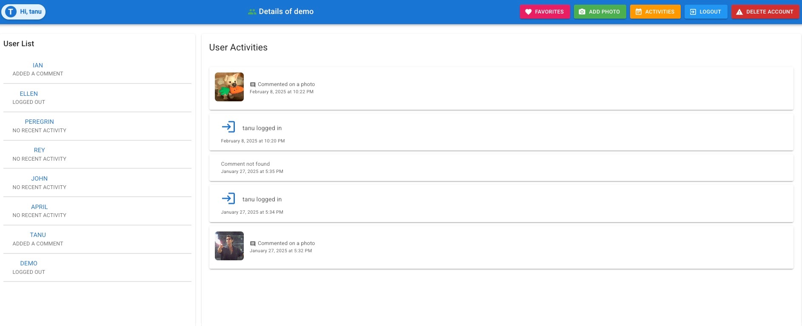
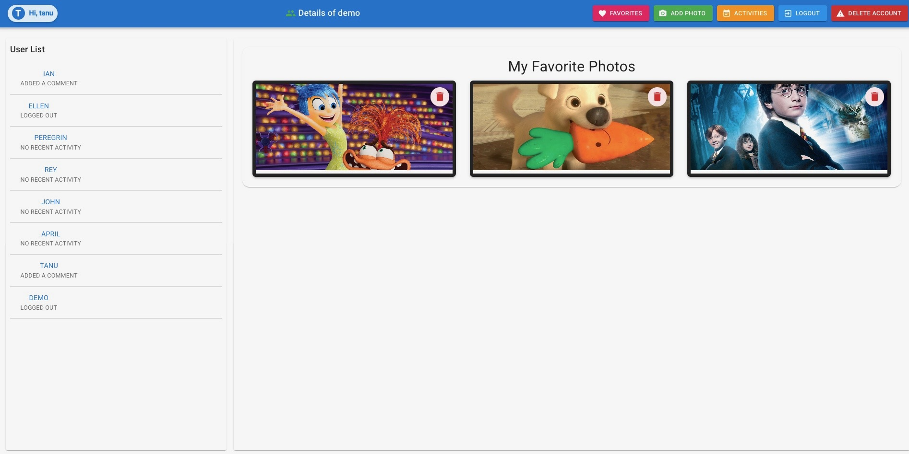
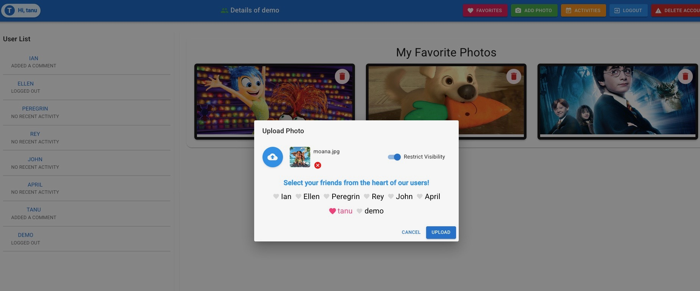
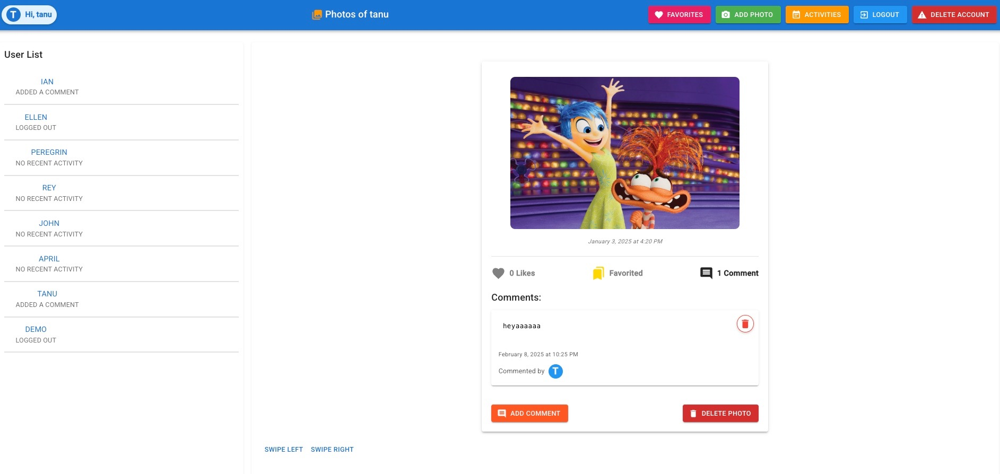

# Photo Sharing App

## About
This is a **Stanford Application**, designed as a full-featured **photo-sharing platform** using the **MERN (MongoDB, Express, React, Node.js) stack**. Users can upload photos, interact with each other, and manage privacy settings effectively.



## Features

### User Profile Enhancements
- Displays the **most recently uploaded photo** with a small thumbnail and upload date.
- Shows the **photo with the most comments**, along with the comment count.
- Clicking a thumbnail redirects to the respective photo in the gallery.

### Social Features & Interaction
- **@Mentions in Comments**: Users can tag others in comments, and a dedicated section on profiles shows all photos where they were mentioned.
- **Like System**: Users can like/unlike photos, and like counts are displayed.
- **Favorites List**: Users can mark photos as favorites and access them on a `/favorites` page.

### Privacy & Content Control
- **Photo Visibility Control**: Users can restrict who can view their photos.
- **Deleting Content**: Users can delete their own photos, comments, or their entire account.

### Activity & Notifications
- **Activity Feed**: Displays recent activities such as uploads, comments, and logins.
- **User Activity Indicator**: Highlights users with recent activity in the sidebar.

## Tech Stack
- **Frontend**: React.js
- **Backend**: Node.js, Express.js
- **Database**: MongoDB
- **Authentication**: JWT-based user authentication

## Installation

### Prerequisites
- Install **Node.js** and **MongoDB**

### Steps
1. **Clone the repository:**
   ```sh
   git clone https://github.com/tan-nandam/photo_sharing_app.git
   cd photo_sharing_app
   ```
2. **Install dependencies:**
   ```sh
   npm install
   ```
3. **Start the backend server:**
   ```sh
   node webServer.js
   ```
4. **Start the frontend:**
   ```sh
   npm install
   npm run build
   ```

## Screenshots

### Photos Registration


### Photos Dashboard


### Photos Activities


### Photos Favorites


### Photos Upload


### Photos Viewer


## License
This project is developed as part of a **Stanford Application**. All rights reserved.
